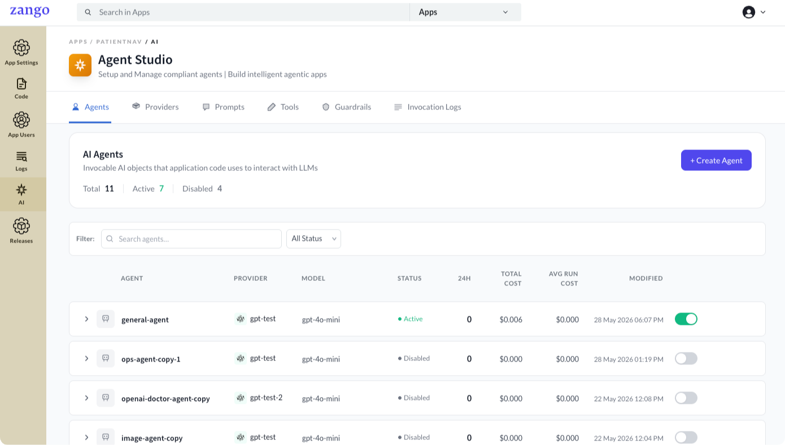

<h1 align="center">
    <a target="_blank" href="https://www.zelthy.com/framework?referer=zelthy3-repo-landing"> 
        
    </a>
</h1>

<h3 align="center">✨ Django framework to build Agentic AI business applications ✨</h3>
<hr>  
<p align="center">
  <a href="#">
        </a> 
  <a href="#">
      </a> 
  <a href="https://opensource.org/licenses/Apache-2.0" target="_blank">
       </a>
</p>

<p align="center">
  <a href="https://www.zango.dev" target="_blank">Website</a> |
  <a href="https://www.zango.dev/docs/get-started/quick-start-with-claude" target="_blank">Quick Start</a> |
  <a href="https://zango.dev/docs" target="_blank">Docs</a> |
  <a href="https://discord.com/invite/WHvVjU23e7" target="_blank">Discord</a>
</p> 


**Zango** is a vertically integrated backend + frontend + operations platform built on Django, designed for rapid development of **Agentic AI business applications**. It is multi-tenant by default and enterprise-ready from day one.

- Leverage the strengths of Django, an already proven and battle-tested web framework
- Multi-tenant SaaS built in: one deployment, data isolated per tenant, zero leakage
- Auth is configured, not coded: OTP, MFA, SAML 2.0, session control, password policy, account lockout
- Compliance-ready: access logs, audit trails, and policy management on from day one
- Native AI module: agents, tools, and prompts with per-tenant context, workflow state, and cost tracking
- Suite of essential packages — AppBuilder, CRUD, Workflow, Communication — as building blocks
- Host multiple apps or microservices on a single monolith with full data isolation

[](https://gitpod.io/#https://github.com/Healthlane-Technologies/Zango/)


#### App Panel - Central hub to manage all your apps/ microservices
Perform tasks such as configuring permissions, managing user roles, and much more. 


#### Drastically reduce your infrastructural and operational overheads by hosting multiple apps/ microservices on a single deployment:

Zango redefines multi-tenancy by enabling multiple different apps to run on a single server. Say goodbye to the limitations of traditional scaling methods. With our platform, you can run multiple different applications on a single server, which helps in keeping the cost in check.


#### Staying ahead

Star Zango on GitHub and be instantly notified of new releases.


#### ⚡ [Quick Start with Claude Code](https://www.zango.dev/docs/get-started/quick-start-with-claude)

The fastest way into Zango is through the `zango-app-developer` plugin for [Claude Code](https://claude.com/product/claude-code). Install it once, describe your app in plain English, and the plugin generates the code, runs migrations, syncs policies, and configures the platform — no separate "click through the App Panel" step.

```bash
# Add the marketplace and install the plugin
claude plugin marketplace add Healthlane-Technologies/zelthy-claude-skills
claude plugin install zango-app-developer@zelthy
```

Then open Claude Code in an empty folder and run `/zango-app-developer`. The plugin bootstraps a full local environment (Docker or virtualenv), creates your app, installs packages, and builds the first version of your feature from a plain-language description.

Full walkthrough: [Quick Start with Claude Code](https://www.zango.dev/docs/get-started/quick-start-with-claude)


#### 🤖 Agent Studio

Zango has a first-class AI module built in — not a bolt-on. Define agents, attach tools, and call them from any view, background task, or scheduled job. Because the module runs inside the platform, every agent automatically operates in the correct tenant's data, respects the same role-based permissions as the rest of the app, and logs every invocation with token counts and cost.



**What this means in practice:**
- An agent reading or writing data always sees the right tenant's records — no manual scoping
- Agent endpoints are policy-gated like any other view — no separate auth layer to build
- Run `agent.run()` inside a Celery task and it becomes a fully autonomous background worker
- Every run is logged: prompt rendered, tools called, response, tokens used, USD cost — per tenant

**Supported providers:** OpenAI and Anthropic, with more coming soon. API keys are stored encrypted in the App Panel; no secrets in code.

[Read the AI module docs →](https://www.zango.dev/docs/ai-module/)


#### 📦 Packages

Packages are installed from the App Panel. The core three must be installed in order: **AppBuilder → CRUD → Workflow**.

- [AppBuilder](https://www.zango.dev/docs/platform-internals/packages/appbuilder/introduction) — React shell with routing, navigation, themes, and auth UI
- [CRUD](https://www.zango.dev/docs/platform-internals/packages/crud/introduction) — `BaseCrudView` + `ModelTable` + `BaseForm` + `CrudHandler` for data-management screens
- [Workflow](https://www.zango.dev/docs/platform-internals/packages/workflow/introduction) — lifecycle management: statuses, transitions, tags, audit trail
- [Communication](https://www.zango.dev/docs/platform-internals/packages/communication/introduction) — SMS, email, audio & video via configurable providers


#### 🌟 Get Involved and Make a Difference

Join our community and help build **Zango**. Here's how you can get involved:

- **Star the Repo:** Show your support by giving us a star! ⭐️
- **Spread the Word:** Share Zango with your colleagues and friends. 📣
- **Join the Conversation:** Share your brilliant ideas and suggestions on Discord [here](https://discord.com/invite/WHvVjU23e7). 💬
- **Report Issues:** Notice something not quite right? Let us know by creating an issue. Your feedback is invaluable! 🐛
- **Contribute Code:** Dive into open issues and send pull requests to help us squash bugs and implement exciting enhancements. 🛠️

Together, let's build something incredible! ✨🚀


#### Official Documentation: https://zango.dev/docs
