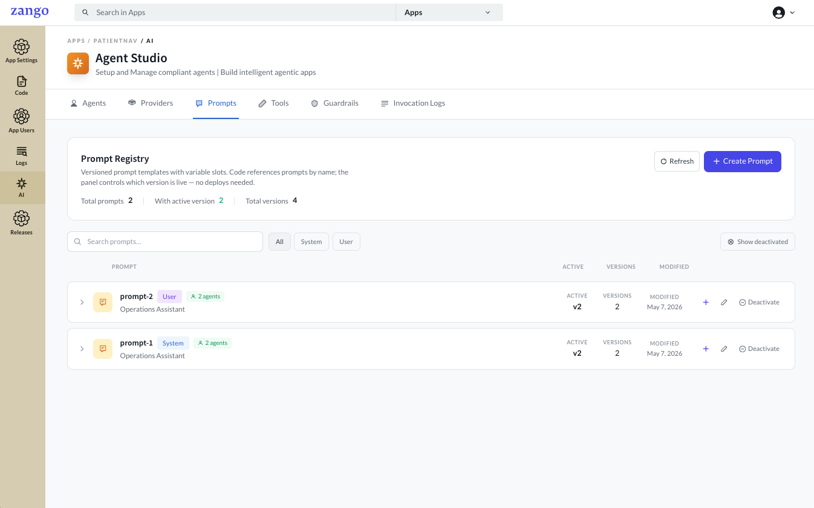
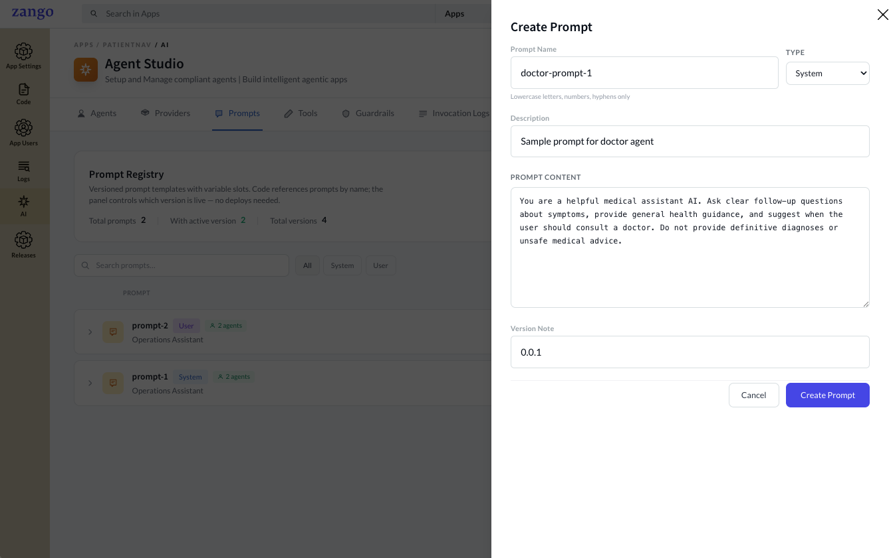
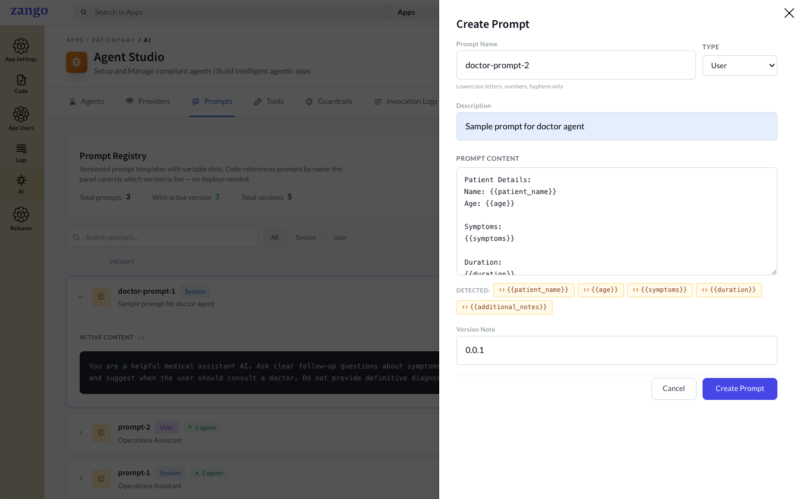
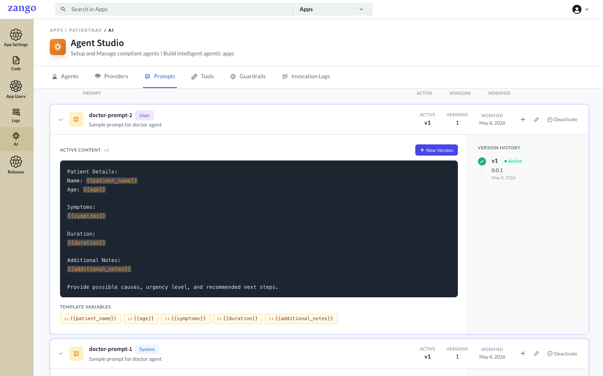
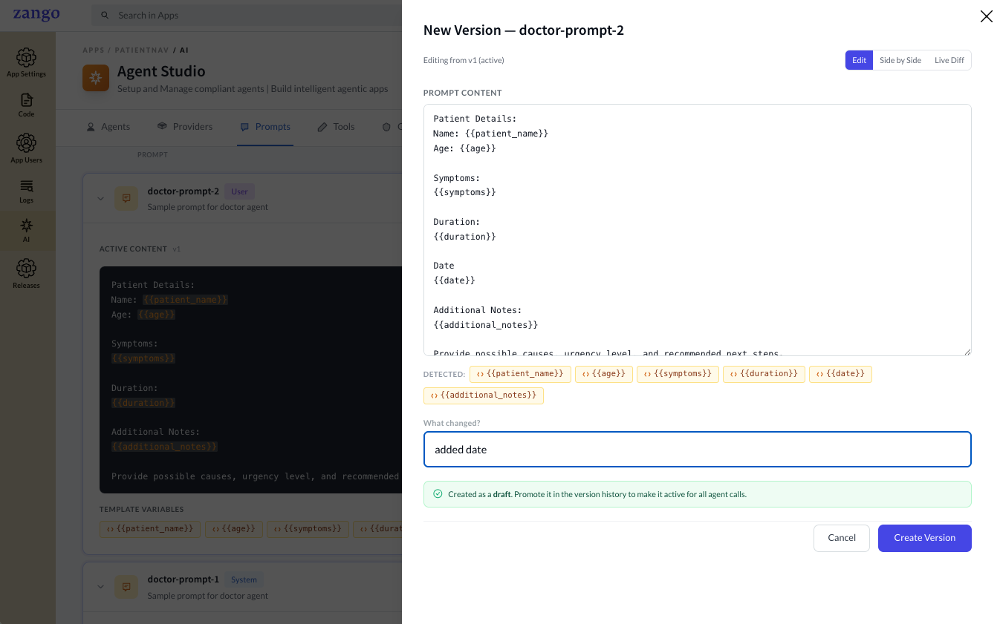
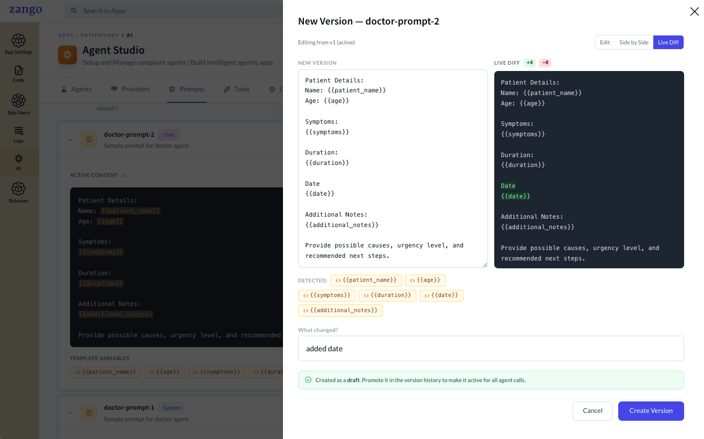
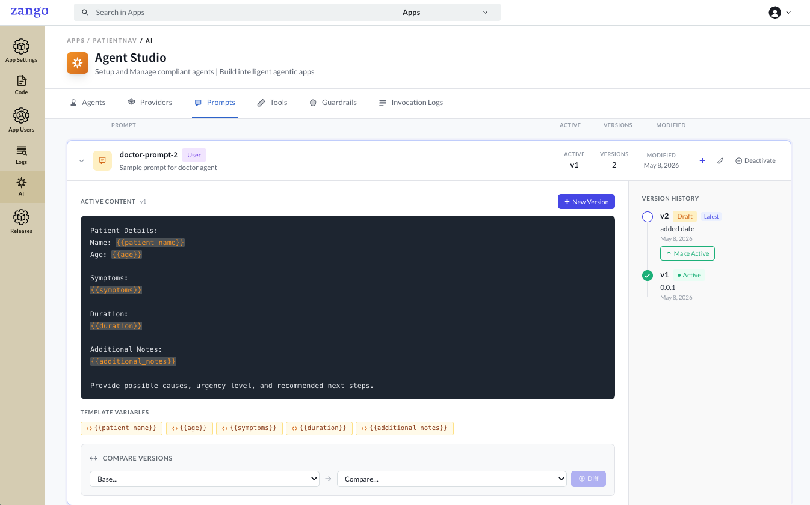

# Creating a Prompt

A Prompt defines the system instructions given to an agent. Prompts are managed separately from agents so you can reuse the same prompt across multiple agents or swap prompts without changing agent configuration.

## Creating a Prompt

1. Go to **App Panel → your app → AI → Prompts**.

2. Click **Create Prompt**.

    

3. Fill in the prompt details.

    

    | Field | Description |
    |-------|-------------|
    | **Name** | A unique identifier for this prompt (e.g. `patient-summary-system`) |
    | **Type** | `system` — injected before the conversation; `user` — sent as a user turn |
    | **Description** | Internal note explaining what this prompt is for |
    | **Prompt Content** | The instruction text sent to the model |
    | **Version** | Auto-incremented each time the prompt is saved; new versions start as drafts |

    Both **system** and **user** type prompts support variables using double-brace syntax (e.g. `{{patient_name}}`). Variables are extracted automatically and passed at runtime — `system_variables=` for system prompts, `variables=` for user prompts.

    

4. Click **Create Prompt**.

    

5. The prompt appears in the list and is ready to be attached to an agent.

## Editing a Prompt

Click the prompt name in the list to open the edit view. Each save creates a new draft version — changes only take effect for agents once you activate the new version.

A side-by-side diff is shown for each edit so you can review exactly what changed.

## Prompt Versioning

Every save creates a new version, which starts as a **draft**. Drafts are not used by agents until you explicitly promote one by clicking **Make Active**. Only the active version is resolved when an agent references this prompt by name.

:::note
Activating a new version immediately affects every agent attached to this prompt. To experiment safely, create a separate prompt with a different name and test it on a non-production agent first.
:::

## Next Steps

With prompts ready, [define tools](./defining-tools) your agent can call.
