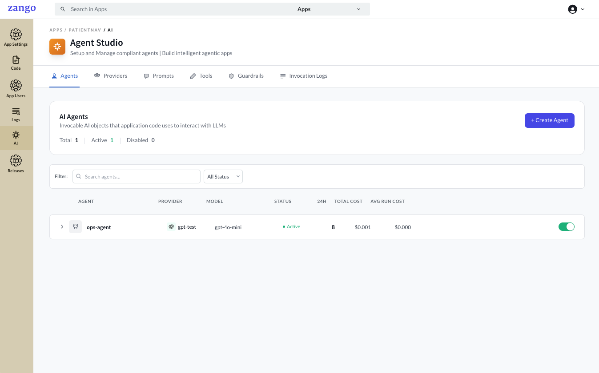
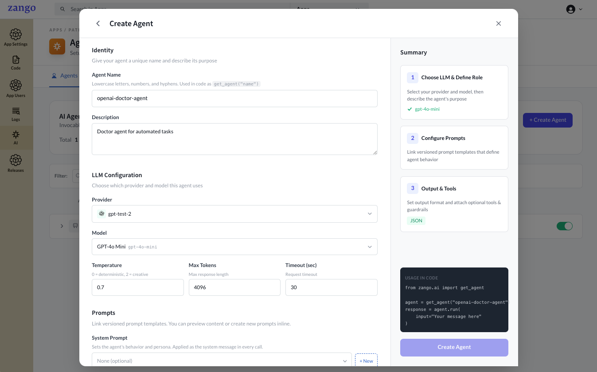
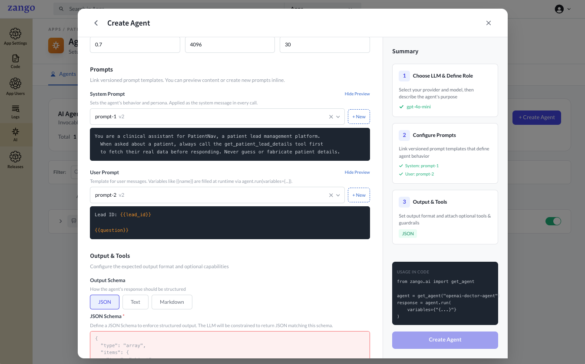
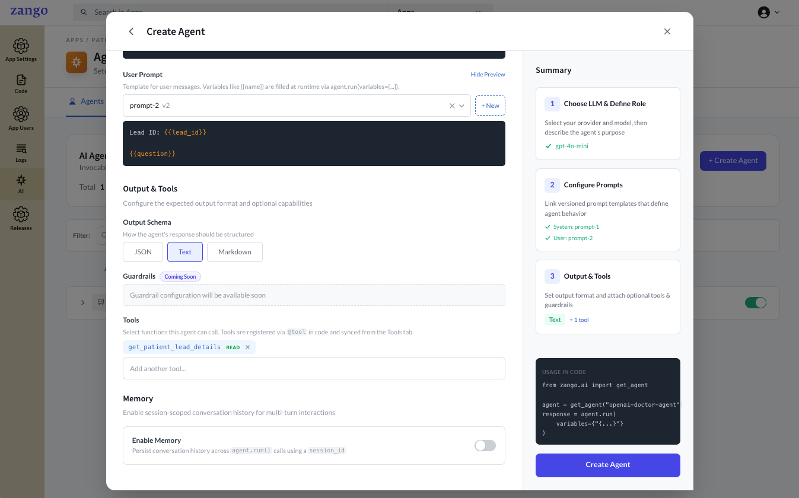
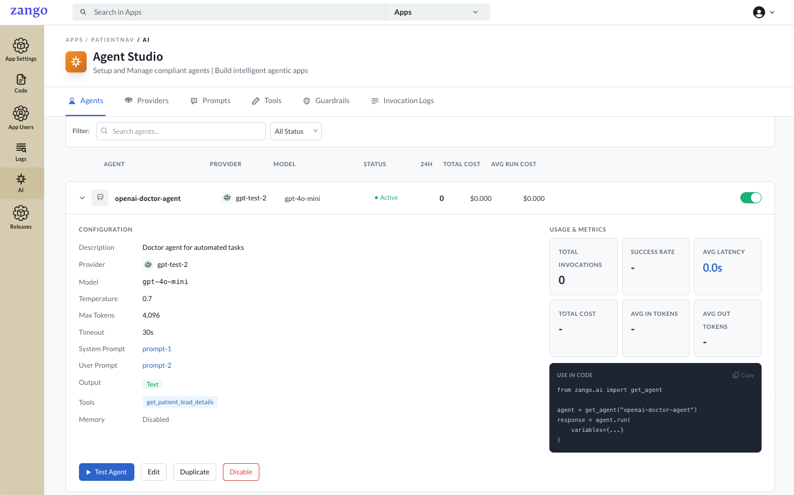
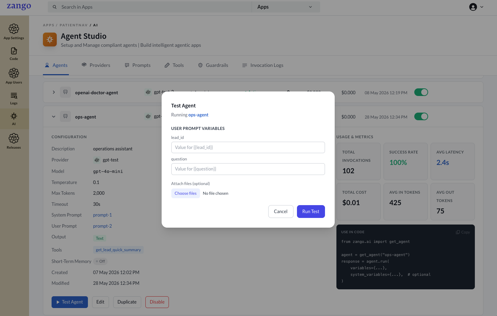
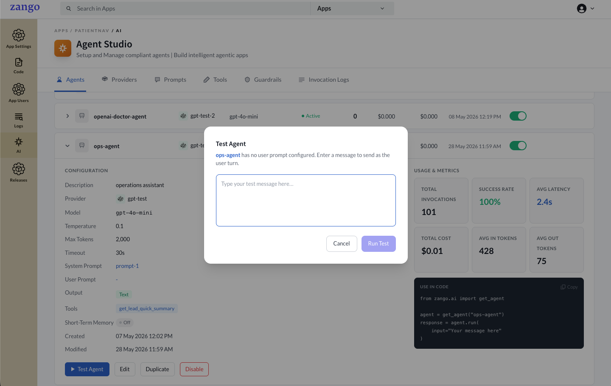
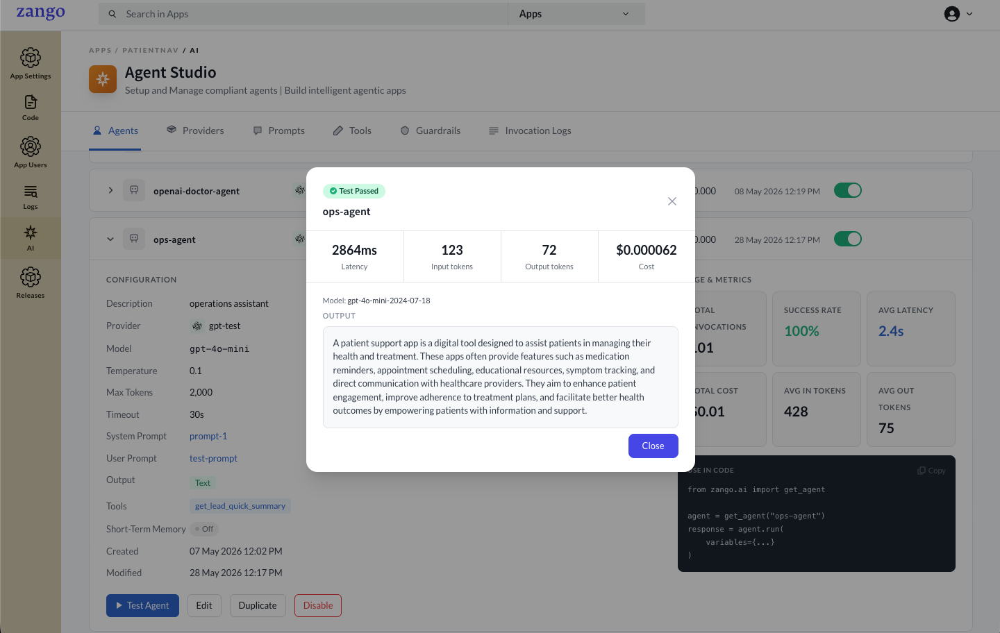

# Creating an Agent

An Agent is a named, configurable LLM persona that combines a provider, prompts, model settings, and tools. Agents are managed per tenant in the App Panel and are referenced by name in your application code.

## Creating an Agent

1. Go to **App Panel → your app → AI → Agents**.
2. Click **Add Agent**.

    

3. Fill in the configuration:

    

    ### Basic Settings

    | Field | Description |
    |-------|-------------|
    | **Name** | A unique slug used to look up the agent in code (e.g. `patient-summary-agent`). Must be unique within the tenant. |
    | **Description** | Internal description of what this agent does. |
    | **Provider** | Select the LLM provider configured in the previous step. |
    | **Model** | The specific model to use (e.g. `gpt-4o-mini`, `claude-3-5-sonnet`). |
    | **Temperature** | Controls randomness. `0.0` is deterministic; `1.0` is creative. Default: `0.7`. |
    | **Max Tokens** | Maximum tokens in the response. Default: `2000`. |
    | **Output Schema** | `Text` for plain text responses; `JSON` if you need structured output (see [JSON Output Schema](#json-output-schema) below). |
    | **Short-term Memory** | Enable to retain conversation history across multiple `agent.run()` calls within the same session. Set **Max Messages** to control the sliding window of message pairs loaded per call (default: 20). |

    ### Prompts

    Select the prompts to attach to this agent. A prompt defines the system or user instructions sent to the model on every run. Prompts can be [created beforehand](./creating-a-prompt) or attached later by editing the agent.

    

    ### Tools

    Select the tools this agent is allowed to call. Tools can be [defined and synced](./defining-tools) beforehand or attached later by editing the agent.

    

4. Click **Create Agent**.

    


## JSON Output Schema

When **Output Schema** is `JSON`, you must supply a schema. Rules differ by provider and are mentioned below.

import Tabs from '@theme/Tabs';
import TabItem from '@theme/TabItem';

<Tabs>
<TabItem value="openai" label="OpenAI">

Three strict requirements apply: 

1.  Every `object` needs `"additionalProperties": false`
2.  Every property must be in `required`
3.  Nullable fields use `anyOf` — not `{"type": ["string", "null"]}`.

```json
{
  "type": "object",
  "additionalProperties": false,
  "required": ["summary", "is_urgent", "tags", "assigned_to"],
  "properties": {
    "summary":     { "type": "string" },
    "is_urgent":   { "type": "boolean" },
    "tags":        { "type": "array", "items": { "type": "string" } },
    "assigned_to": { "anyOf": [{ "type": "string" }, { "type": "null" }] }
  }
}
```

</TabItem>
<TabItem value="anthropic" label="Anthropic">

Standard JSON Schema — no strict rules. Optional properties, shorthand nullable types, and objects without `additionalProperties` are all accepted.

```json
{
  "type": "object",
  "properties": {
    "summary":     { "type": "string" },
    "is_urgent":   { "type": "boolean" },
    "tags":        { "type": "array" },
    "assigned_to": { "type": ["string", "null"] }
  }
}
```

</TabItem>
</Tabs>

## Referencing the Agent in Code

The **Name** field you set is the identifier used to look up this agent in your application code via `get_agent("your-agent-name")`.

For the full range of ways to call an agent — with plain text, prompt variables, file attachments, memory sessions, JSON output, and background tasks — see [Running Agents](./running-agents).

:::caution
If the name does not match exactly (case-sensitive), `get_agent()` raises `AgentNotFound`. The agent must also be enabled for it to be found.
:::

## Testing an Agent

You can run a quick test directly from the App Panel without writing any code.

1. Go to **App Panel → your app → AI → Agents**.
2. Click the **Test** button on any agent row. A test modal opens.

**The test modal includes:**

- **System Prompt Variables** — if the agent's system prompt contains `{{placeholders}}`, an input field appears for each variable.
- **User Prompt Variables** — if the agent's user prompt contains `{{placeholders}}`, an input field appears for each variable.
- **File upload** — attach one or more files (images, PDFs, documents) to include in the test run.



- **Message input** — only shown when the agent has no user prompt configured. Type a message to use as the user input.



The Result of the Agent Test Run is displayed in the modal like below



The test result modal shows:
- The LLM's response (up to 2000 characters)
- Latency in milliseconds
- Input and output token counts

:::note
Test runs are real invocations — they are logged in Invocation History and accrue cost against the provider.
:::

## Editing and Deactivating Agents

Agents can be edited at any time from the agents list. Deactivating an agent prevents `get_agent()` from resolving it without changing any code.

## Next Steps

With an agent created, [create prompts](./creating-a-prompt) and attach them to it, then [define tools](./defining-tools) your agent can call.
