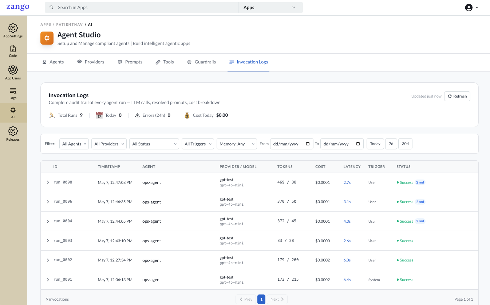
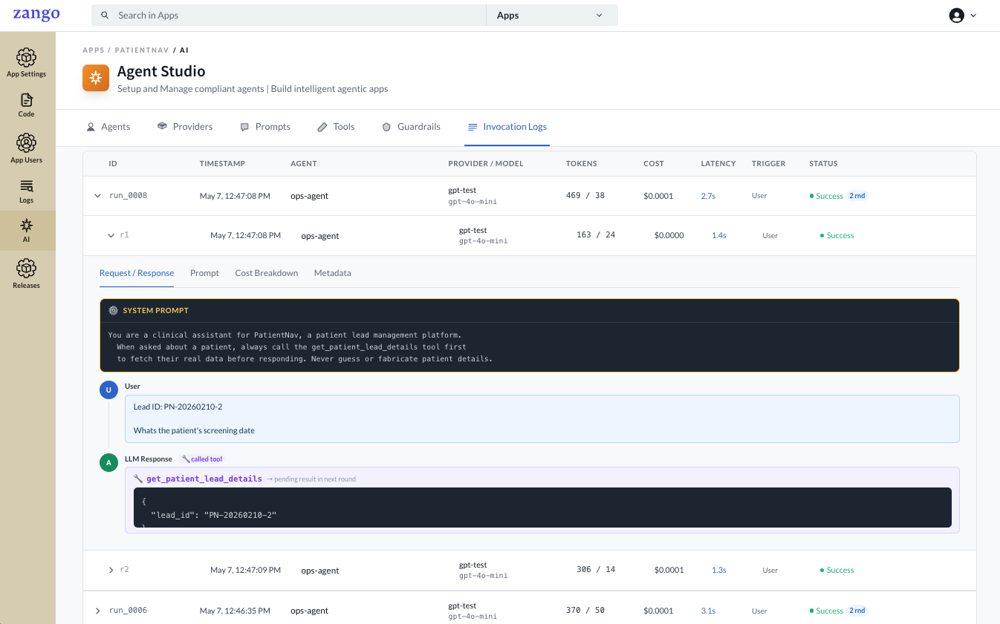
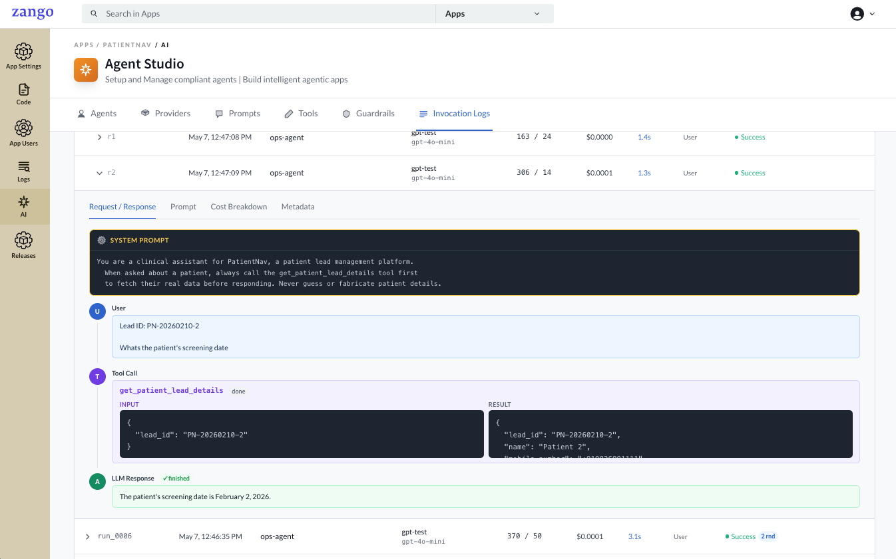
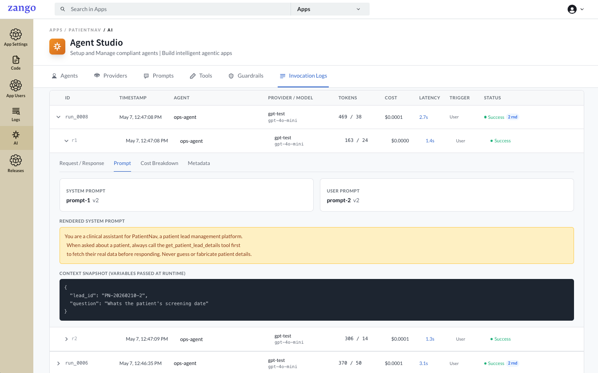
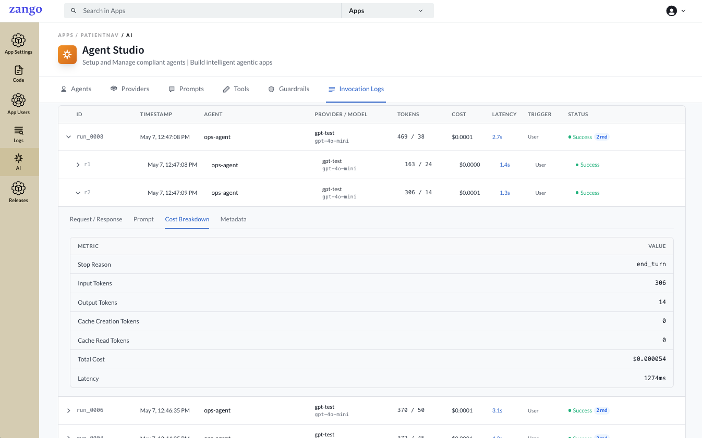
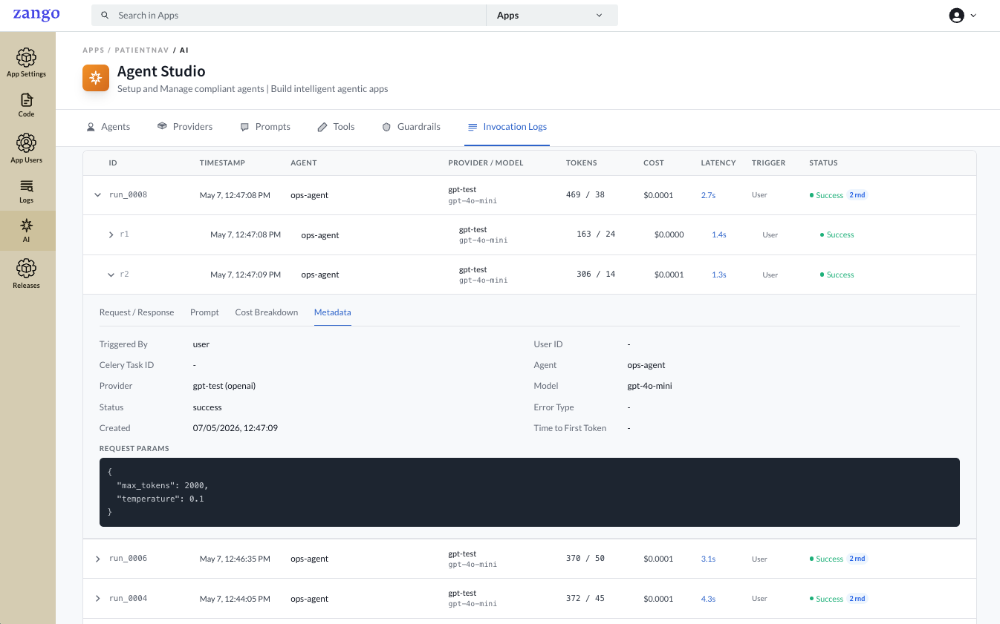
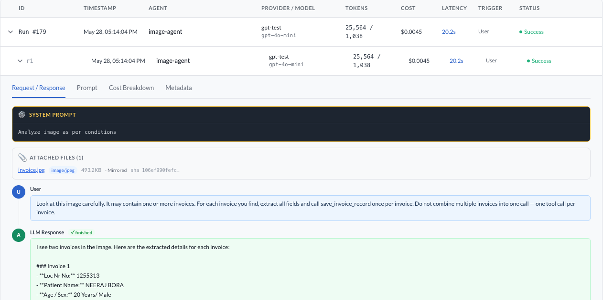
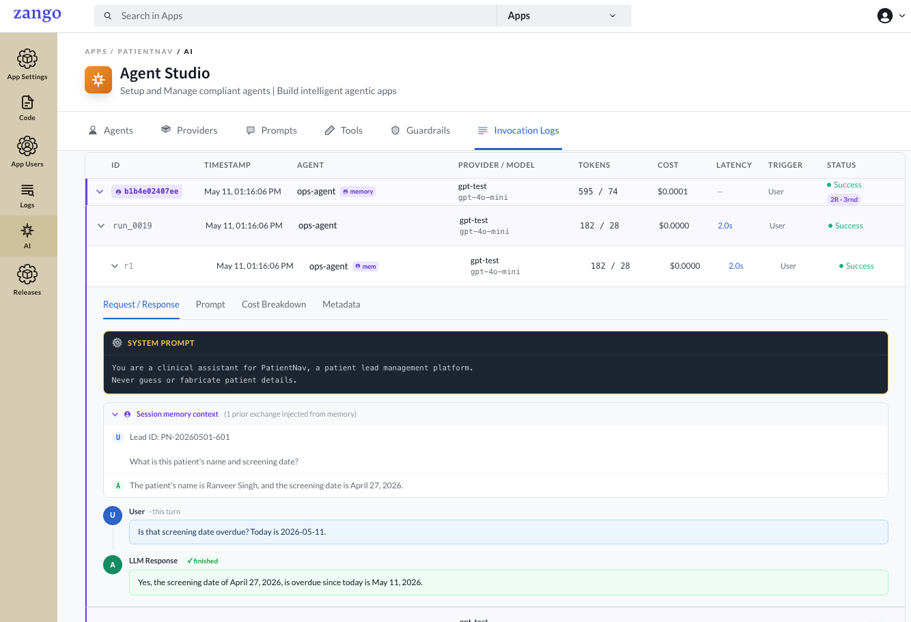

# Invocation Logs

Every `agent.run()` call is recorded as an invocation. Use the Invocation Logs tab to debug agent behaviour, inspect tool calls, audit prompts, and track LLM costs per tenant.

## Viewing Invocations

Go to **App Panel → your app → AI → Invocation Logs**.

The header bar shows a live summary — **Total Runs**, **Today**, **Errors (24h)**, and **Cost Today** — updated on each refresh.

Use the filters to narrow down the list by agent, provider, status, trigger source, short-term memory, and date range.

Each row in the list shows:

| Column | Description |
|--------|-------------|
| **ID** | Unique run identifier (e.g. `run_0008`) |
| **Timestamp** | When the run was initiated |
| **Agent** | The agent that was invoked |
| **Provider / Model** | The provider configuration and model used |
| **Tokens** | Input / output token counts for the full run |
| **Cost** | Total USD cost for this run |
| **Latency** | Wall-clock time from start to final response |
| **Trigger** | `User`, `System`, or `Task` — set via `triggered_by` in `agent.run()` |
| **Status** | `Success`, `Failed`, or `Timeout` |

## Rounds

Click the arrow on any row to expand it. Each run can consist of multiple **rounds** — one LLM call per round. Multi-round runs occur when the agent calls a tool and then makes a second LLM call to process the tool result.

Each round (e.g. `r1`, `r2`) is listed with its own token count, cost, latency, and status. Click a round to open its detail tabs.

## Round Detail Tabs

### Request / Response

Shows the full message sequence for that round in conversation order:

| Field | Description |
|-------|-------------|
| **System Prompt** | The rendered system instruction sent to the model |
| **User** | The user message (with variables already substituted) |
| **LLM Response** | The model's reply; if it called a tool, this shows the tool name and the arguments passed |

For rounds where a tool call completed, the **Tool Call** block shows the tool name, its **Input** (arguments the LLM passed), and the **Result** returned by your code. The final LLM response below it shows how the model used that result.

### Prompt

Shows the prompt configuration used for this round.

| Field | Description |
|-------|-------------|
| **System Prompt** | Name and version of the system prompt attached to the agent |
| **User Prompt** | Name and version of the user prompt attached to the agent |
| **Rendered System Prompt** | The final text sent to the model after variable substitution |
| **Context Snapshot** | The variables passed at runtime — `variables` (user prompt) and `system_variables` (system prompt) |

### Cost Breakdown

Per-round token and cost detail.

| Field | Description |
|-------|-------------|
| **Stop Reason** | Why the model stopped generating (`end_turn`, `tool_use`, etc.) |
| **Input Tokens** | Tokens in the prompt sent to the model |
| **Output Tokens** | Tokens in the model's response |
| **Cache Creation Tokens** | Tokens written to the provider's prompt cache |
| **Cache Read Tokens** | Tokens read from the provider's prompt cache |
| **Total Cost** | USD cost for this round |
| **Latency** | Time taken for this round in milliseconds |

### Metadata

Low-level invocation metadata and the raw request parameters sent to the LLM API.

| Field | Description |
|-------|-------------|
| **Triggered By** | Source of the invocation (`user`, `system`, `task`) |
| **User ID** | The authenticated user who triggered the run, if applicable |
| **Celery Task ID** | Set when the invocation was triggered from an async task |
| **Agent** | Agent name |
| **Provider** | Provider configuration name |
| **Model** | Model identifier used |
| **Status** | Final status of this round |
| **Error Type** | Error class if the round failed |
| **Created** | Exact timestamp of the round |
| **Time to First Token** | Latency to the first token from the LLM |
| **Request Params** | Raw parameters sent to the API (e.g. `max_tokens`, `temperature`) |

## File Attachments in Logs

When files are passed to `agent.run()` via `files=`, each file is automatically saved to the tenant's storage for audit purposes. The invocation detail view displays them in an **Attached files** section above the message sequence.

| Field | Description |
|-------|-------------|
| **Filename** | Original filename — shown as a clickable download link when the file was mirrored to storage |
| **Media type** | MIME type (e.g. `image/png`, `application/pdf`) |
| **Size** | File size in B / KB / MB |
| **Source** | `Mirrored` — bytes were saved to tenant storage; `URL (not mirrored)` — only the original URL was recorded (files attached via `LLMFile.from_url`) |
| **SHA-256** | Truncated content hash for deduplication and integrity checks |

Files sourced from `LLMFile.from_url()` are recorded with the original URL but **not** mirrored — only the URL and identity metadata are stored. All other sources (Django file fields, raw bytes, local paths) are mirrored into the tenant's file storage and available for download from the log.

Audit storage is **fail-open** — if persisting a file fails, the error is logged but the agent run continues normally.

## Memory Sessions in Logs

When an agent has **short-term memory** enabled, the invocation log shows the full conversation context injected from prior turns — making it easy to audit exactly what history the model saw.

---

## Cost Tracking

The invocation list aggregates cost per run. Use it to:

- Identify expensive agents and optimise prompts or token usage
- Monitor cost trends by agent or time period
- Estimate per-tenant LLM spend

The `response.cost_usd` value returned by `agent.run()` matches the cost recorded here.

## Agent-Level Stats

The **Agents** tab shows aggregate stats per agent across all runs:

| Column | Description |
|--------|-------------|
| **Total Invocations** | Total number of times this agent has been run |
| **Total Cost (USD)** | Cumulative LLM cost across all invocations |

These are scoped per tenant and not shared across apps.
