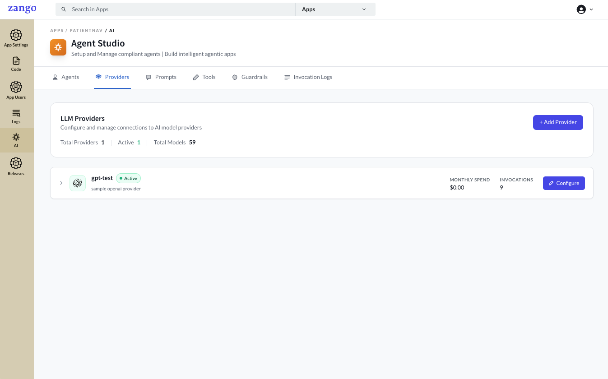
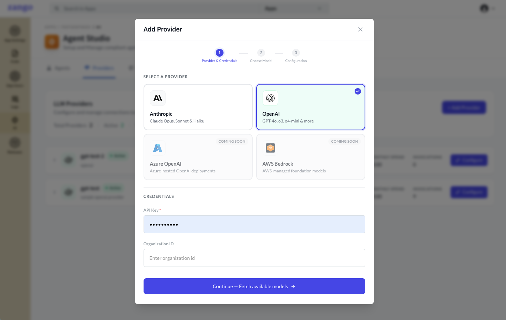
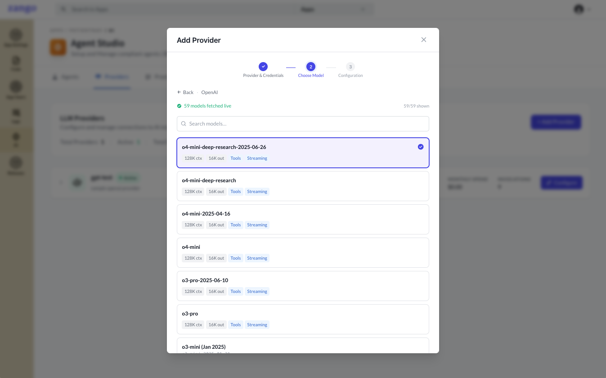
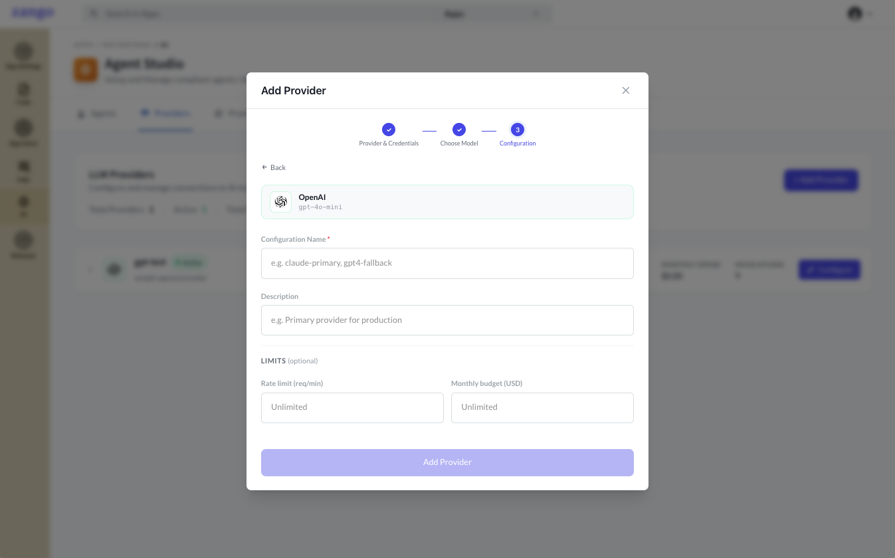
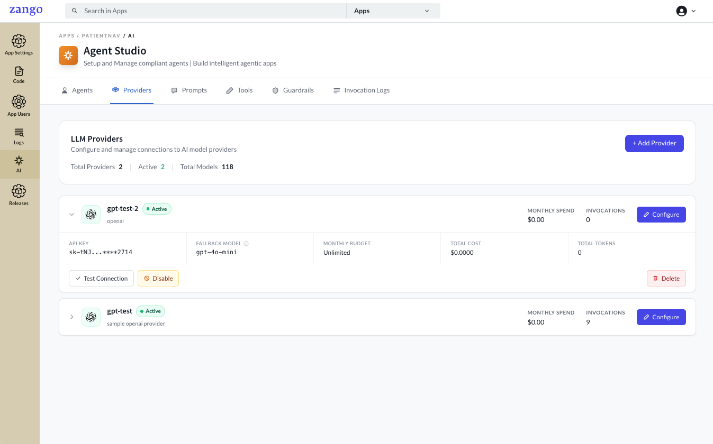

# Setting Up an LLM Provider

An LLM Provider stores the connection credentials for a Large Language Model API. Providers are configured per tenant in the App Panel. You must create at least one provider before creating any agents.

## Supported Providers

Zango currently supports **OpenAI** and **Anthropic**. Available models are fetched automatically from the provider once a valid API key is saved.

:::note Coming Soon
Azure OpenAI and Amazon Bedrock support are planned for a future release.
:::

## Creating a Provider                                                                                                                                                                                                 
                                                                                                                                                                                                           
1. Open the **App Panel** → navigate to your app.
2. Go to **AI → Providers**.                                                                                                                                                                                                                                                                                                                                                        
3. Click **Add Provider**.                                                                                                                                                                             

                                                                                                                                                                    
   
    Select your provider and fill in the form

    | Field | Description |
    |-------|-------------|
    | **Provider Type** | OpenAI, Anthropic, or custom |
    | **API Key** | Stored encrypted using field-level encryption — never exposed in plaintext after saving |
    | **Organization ID** | (OpenAI only) Your OpenAI organization identifier — optional, leave blank if unused |

    

    Click **Continue**.

4. Choose your model from the list of available Models

    

5. Fill in the final details for the provider

    | Field | Description |
    |-------|-------------|
    | **Name** | A label for this provider configuration |
    | **Description** | Optional notes about this provider's intended use |
    | **Rate Limit** | Maximum requests per minute — leave blank for no limit |
    | **Monthly Budget (USD)** | Spend cap in USD; Zango stops routing requests once reached — leave blank for unlimited |

    

    Click **Add Provider** to create the provider

6. The provider is created and can be viewed under the Provider section

    

## Security

API keys are encrypted at rest using Zango's `FIELD_ENCRYPTION_KEY`. The key value is write-only in the UI — once saved, only the key name is visible. Rotate a provider's key at any time by editing the record.

:::tip
Never put LLM API keys in your app code or the project `.env` file. Always use the App Panel provider credentials — they are stored encrypted per tenant and are not shared across apps.
:::

## Multiple Providers

You can configure multiple providers per tenant. Each agent selects its provider individually, so you can mix providers across agents within the same tenant.

## Next Steps

Once a provider exists, [create an agent](./creating-an-agent) and select this provider for it.
