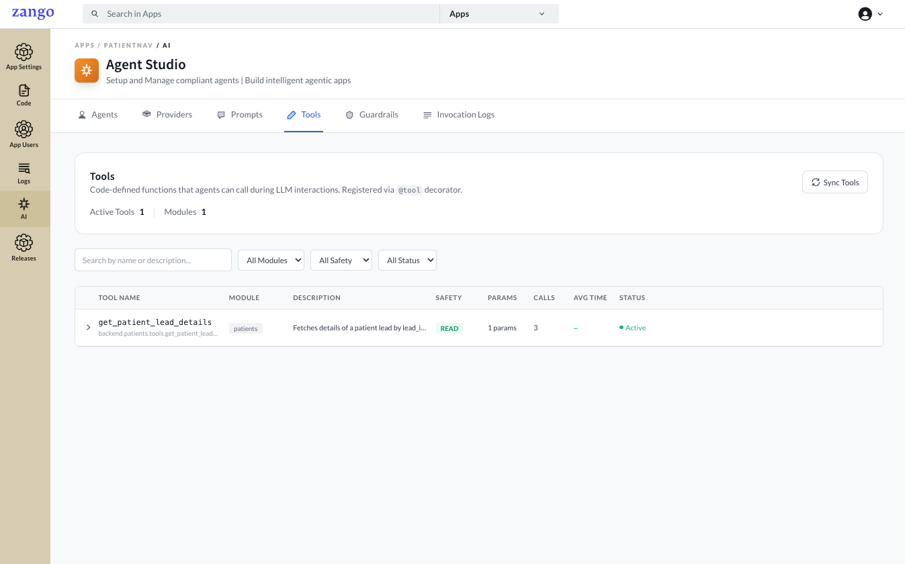
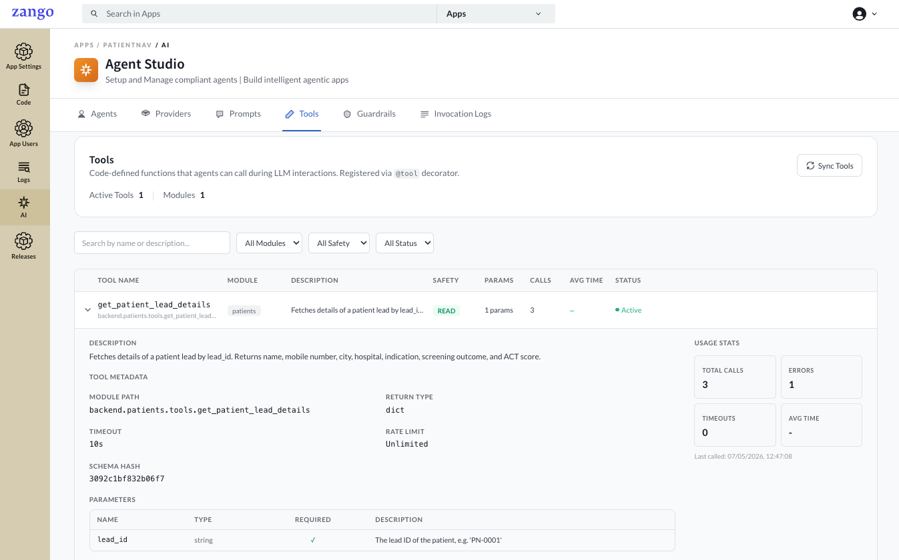

# Syncing Tools

After defining tools in your `tools.py` files, you must sync them from the App Panel so Zango discovers them and makes them available to agents. Syncing also picks up any changes to tool names, descriptions, or parameters.

## When to Sync

Sync tools whenever you:

- Add a new `@tool` decorated function
- Change a tool's `name`, `description`, or `section`
- Add, remove, or change a `ToolParam` description
- Move a tool to a different module

## How to Sync

1. Go to **App Panel → your app → AI → Tools**.
2. Click **Sync Tools**.

Zango scans all `tools.py` files across your app's modules, registers new tools, and updates existing ones.

## Viewing Synced Tools

After syncing, each discovered tool appears in the list with:

| Column | Description |
|--------|-------------|
| **Name** | The `name` from the `@tool` decorator |
| **Section** | The `section` grouping |
| **Safety** | `READ_ONLY`, `WRITE`, or `EXTERNAL` |
| **Description** | What the tool does (shown to the LLM) |
| **Module** | The Python module path where the tool is defined |

Clicking a tool opens its detail view.

### Tool Metadata

| Field | Description |
|-------|-------------|
| **Module Path** | Full Python import path to the tool function |
| **Return Type** | The Python type returned by the tool (e.g. `dict`, `str`) |
| **Timeout** | Maximum execution time before the call is aborted |
| **Rate Limit** | Maximum calls allowed per minute for this tool |
| **Schema Hash** | Fingerprint of the tool's parameter schema — changes when parameters are added, removed, or renamed |

### Parameters

| Column | Description |
|--------|-------------|
| **Name** | Parameter name as declared in `ToolParam` |
| **Type** | Expected data type (e.g. `string`, `integer`) |
| **Required** | Whether the agent must supply this parameter |
| **Description** | Text shown to the LLM to describe what the parameter expects |

### Status & Usage Stats

| Field | Description |
|-------|-------------|
| **Status** | Whether the tool is active and available to agents |
| **Safety** | `READ_ONLY` — reads only; `WRITE` — modifies database records; `EXTERNAL` — calls outside services |
| **Params** | Number of declared parameters |
| **Calls** | Total number of times this tool has been invoked |
| **Errors** | Number of invocations that returned an error |
| **Timeouts** | Number of invocations that exceeded the timeout |
| **Avg Time** | Average execution time across all calls |

## Assigning Tools to Agents

Synced tools become available in the **Tools** field when editing an agent. A tool must be synced before it can be assigned to any agent. Open the agent, select the tools, and save.

:::note
Tools are tenant-scoped. Syncing in one tenant's App Panel does not affect other tenants.
:::

## Next Steps

With tools attached to your agent, [run the agent](./running-agents) from your app code.
