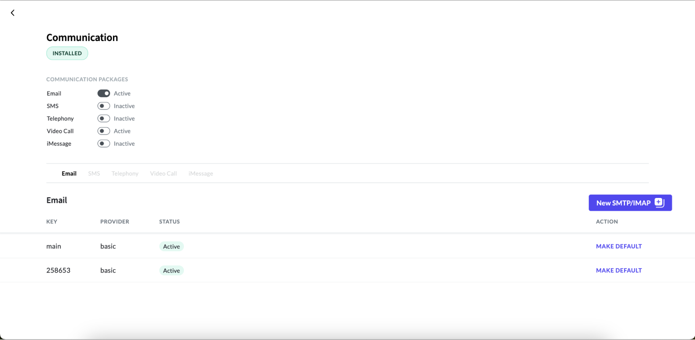

# Activating Email Service

To ensure the effective delivery of emails, it's crucial to activate email services within your application. By enabling this feature in the communication dashboard, you initiate the process of sending and receiving emails seamlessly. Please note that with deactivated email services, transaction records will be created, but the actual email transmission will not occur.

To activate the email service, follow these steps:

#### 1. Access the App Panel

Navigate to your Zango application's landing page and access the App Panel.

#### 2. Navigate to the Communication package

In the App Panel, locate and click on the "Packages" menu and locate the communication package.

#### 3. Access Communication Detail page

Click on the “View Details” link to access the details page of the communication package.

#### 4. Activating email service

On the details page, you'll find a roster of communication packages. Find the Email package within this list and simply toggle the switch to activate the Email service.

