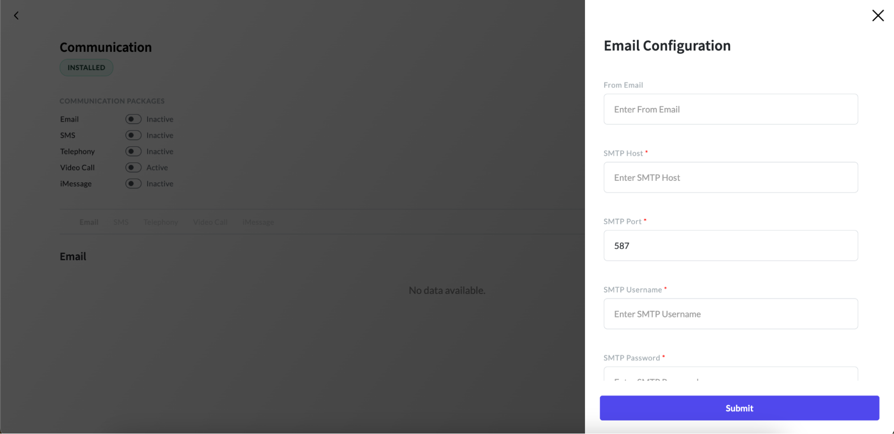

# Adding SMTP/IMAP Service

Utilizing SMTP (Simple Mail Transfer Protocol) allows you to send emails programmatically, while IMAP (Internet Message Access Protocol) enables you to retrieve incoming emails. For adding SMTP/IMAP configurations, follow the below steps:

#### 1. Access the App Panel

Navigate to your Zango application's landing page and access the App Panel.

#### 2. Navigate to the Communication package

In the App Panel, locate and click on the "Packages" menu and locate the communication package.

#### 3. Access Communication Detail page

Click on the “View Details” link to access the details page of the communication package.

#### 4. Open Email Tab

Click on the "Email" tab located under the Communications section.

#### 5. Add New Configuration

Within the Email tab, locate and click on the "New SMTP/IMAP" button.

#### 6. Fill in the Configuration Form

A form will appear for setting up a new configuration. Fill in the required fields, including:

- **From Email:** The email address from which emails will be sent.
- **SMTP Host:** The hostname or IP address of the SMTP server for sending emails.
- **SMTP Port:** The port number used by the SMTP server (e.g., 25, 587, 465).
- **SMTP Username:** The username required for authentication with the SMTP server.
- **SMTP Password:** The password associated with the SMTP username for authentication.
- **SMTP Encryption:** The encryption method used for securing SMTP connections, choose between SSL or TLS.
- **IMAP Host:** The hostname or IP address of the IMAP server for receiving emails.
- **IMAP Port:** The port number used by the IMAP server (e.g., 143, 993).
- **IMAP Username:** The username required for authentication with the IMAP server.
- **IMAP Password:** The password associated with the IMAP username for authentication.
- **IMAP Encryption:** The encryption method used for securing IMAP connections, choose between SSL or TLS.

