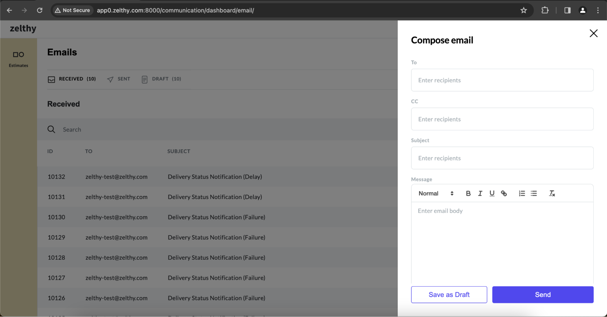

# Sending Email from Dashboard
To send an email from the communication dashboard, it's essential to have one of your email configurations set as default. Otherwise, attempting to send an email will result in an error message. 

## Setting up default Email Configuration

To designate a configuration as default, follow these steps:

#### 1. Access the App Panel:​
Navigate to your Zango application's landing page and access the App Panel.

#### 2. Navigate to the Communication package:​
In the App Panel, locate and click on the "Packages" menu and locate the communication package. 

#### 3. Access Communication Detail page:
Click on the “View Details” link to access the details page of the communication package. 

#### 4. Setting default configuration:
Browse through the available configurations and select a desired configuration as default to enable seamless email sending.

## Sending the Email
To send an email from your application, follow the below steps:

#### 1. Access the Email Dashboard:​

Navigate to your application’s Email dashboard by navigating to the below URL. Ensure to replace “your_domain” with your application’s domain.

```python
http(s)://<your_domain>/communication/dashboard/email
```

#### 2. Accessing the email form 
To access the "Compose email" form, simply click on the option to compose a new email. From there, you can effortlessly craft and send an email to your desired recipient(s). Specify recipient addresses, subject line, message content, and attach any necessary files before sending.



