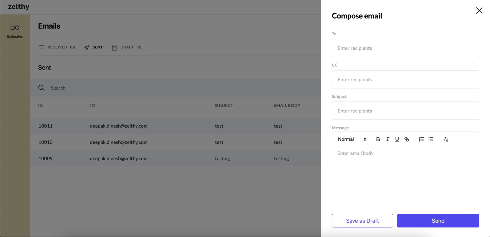

# Introducing Email

Email communication remains one of the most widely used and reliable methods for exchanging information in both personal and professional settings. With its versatility and accessibility, email serves as a cornerstone of modern communication, facilitating seamless correspondence across diverse platforms and devices.

**Endpoint:** Access the email package through the following endpoint.

```python
 http(s)://<your_domain>/communication/dashboard/email
``` 
**Email Dashboard**: View all sent, received, and draft emails in one centralized location.


**Compose Email Form**: Easily access the compose email form directly from the dashboard to draft and send new messages.



With the email package, managing and sending emails within your application becomes effortless, allowing for efficient communication and collaboration across teams and individuals.
