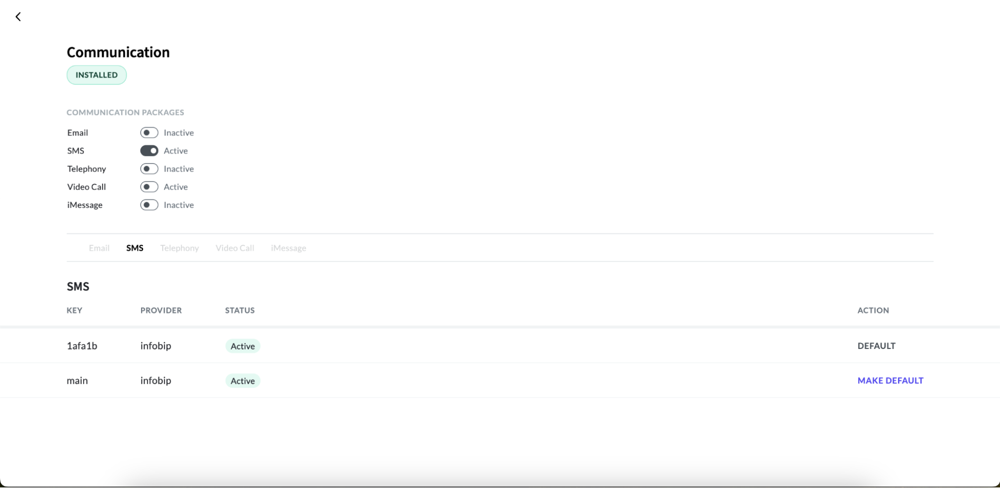

# Activating SMS Service

To leverage the power of SMS communication, it's essential to activate SMS services within your application. By enabling this feature in the communication dashboard, you kickstart the process of sending and receiving SMS messages seamlessly. 

Please note that without activated SMS services, transaction records may be generated, but actual SMS transmissions will not occur, hindering your ability to engage effectively with your audience.

To activate the SMS service, follow these steps:

#### 1. Access the App Panel

Navigate to your Zango application's landing page and access the App Panel.

#### 2. Navigate to the Communication package

In the App Panel, locate and click on the "Packages" menu and locate the communication package.

#### 3.Access Communication Detail page:
Click on the “View Details” link to access the details page of the communication package. 

#### 4. Activating email service:
On the details page, you'll find a roster of communication packages. Find the SMS package within this list and simply toggle the switch to activate the SMS service.

