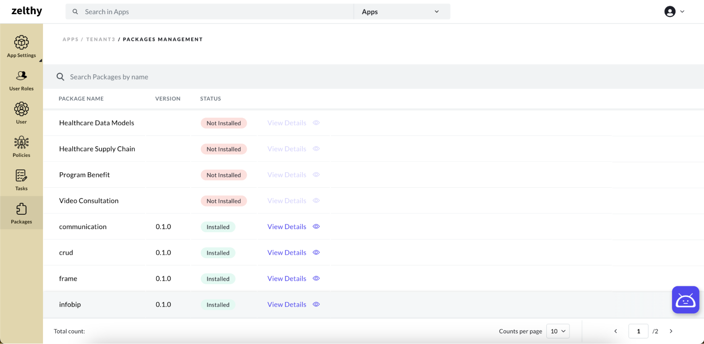
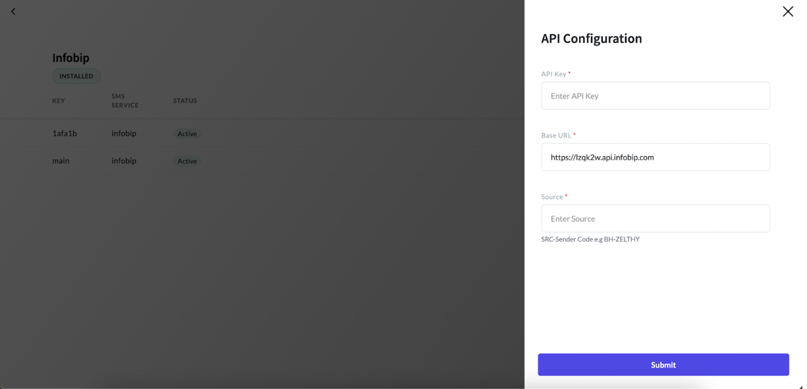

# Configuring Infobip

After successfully installing the Infobip package, you can proceed to configure it to suit your specific needs. Please ensure that you have installed the communication package. The Infobip package relies on the communication package for seamless integration and functionality.

For adding SMS configurations follow the below steps:

#### 1. Access the App Panel

Navigate to your Zango application's landing page and access the App Panel.

#### 2. Navigate to the Packages

In the App Panel, locate and click on the "Packages" menu.

#### 3. Open Infobip’s Configuration Menu

Locate the "Infobip" package and click on the three-dot menu icon located on the right side of the row.

#### 4. Select "Configure Package"

From the context menu that appears, select the "Configure Package" option.

#### 5. Fill in the Configuration Form

A form will appear for configuring the package. Fill in the required fields, including:

- **API Key:** Enter your Infobip API key, which serves as a unique identifier for accessing Infobip's services and resources.
- **Base URL:** Specify the base URL for Infobip's API endpoints. This URL defines the root address for API requests and responses.
- **Source:** Enter the identification of the Sender of SMS.

By configuring these options, you can tailor the Infobip package to integrate seamlessly with your application, enabling efficient communication through Infobip's messaging services.
