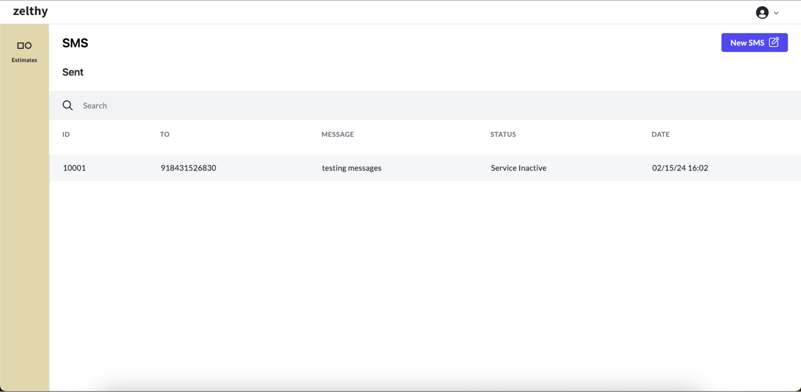

# Introducing SMS

SMS, or Short Message Service, continues to be a ubiquitous and efficient means of communication, providing quick and direct messaging capabilities to users worldwide. Its widespread adoption across various industries underscores its reliability and convenience, making it an indispensable tool for both personal and business communication needs.

**Endpoint:** Access the SMS package through the following endpoint.

```python
 http(s)://<your_domain>/communication/dashboard/sms
``` 
**SMS Dashboard**: View all sent SMS messages in one centralized location, allowing for easy monitoring and management of communication activities.



**Compose SMS Form**: Access the compose SMS form directly from the dashboard to create and send new messages swiftly.


With the SMS package, managing and sending text messages within your application becomes seamless, enhancing communication efficiency and effectiveness across various contexts and audiences.
