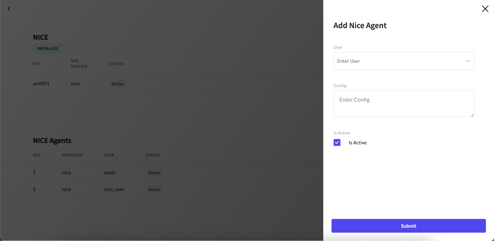
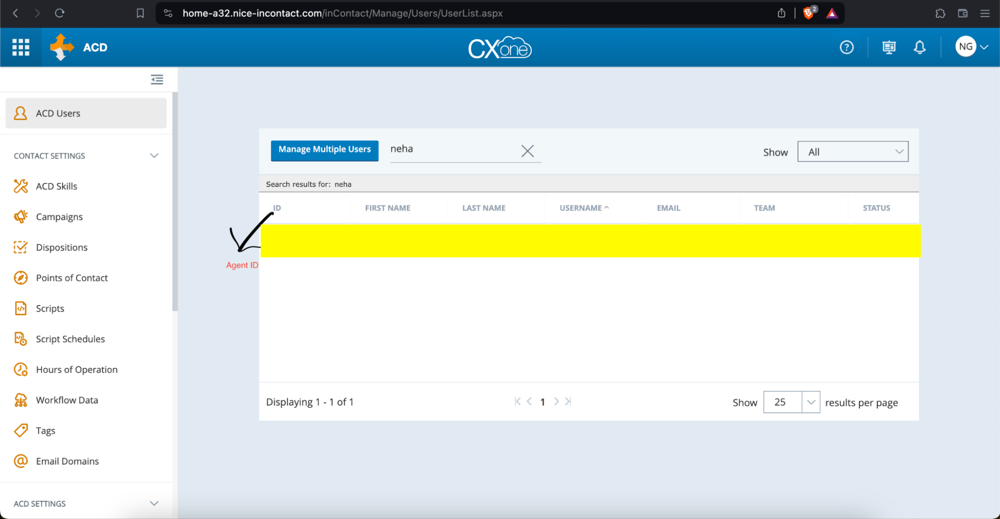

# Adding NICE Agents

To be able to place and receive calls, you must configure NICE agents.

To add NICE agents, follow the below steps:

#### 1. Go to the details page of the NICE package.

Navigate to the details page of the NICE package.

#### 2. Click on the "New Agent" button.

In the details page, click on the "New Agent" button.

#### 3. Fill in the Add NICE Agent form.

In the "Add NICE Agent" form, choose an agent from the user dropdown. Each agent is linked to an App User, with one app user corresponding to only one agent.



#### 4. Enter Configuration Details

Enter the configuration details in the config field using the following format:

```json
{
    "agentId": "<agent_id>",
    "api_user_secret_id": "<access_id>",
    "api_user_secret_key": "<access_key>"
}
```

#### 5. Generate Access ID and Key
To generate access ID and key for a user, refer to the instructions provided in the article on configuring agent access keys - configure agent access keys

#### 6. Obtain Agent ID
If you don’t have an Agent ID, log into your NICE portal using this  URL. Navigate to the ACD Users tab, search for your username, and copy your Agent ID. Refer to the following screenshot.


