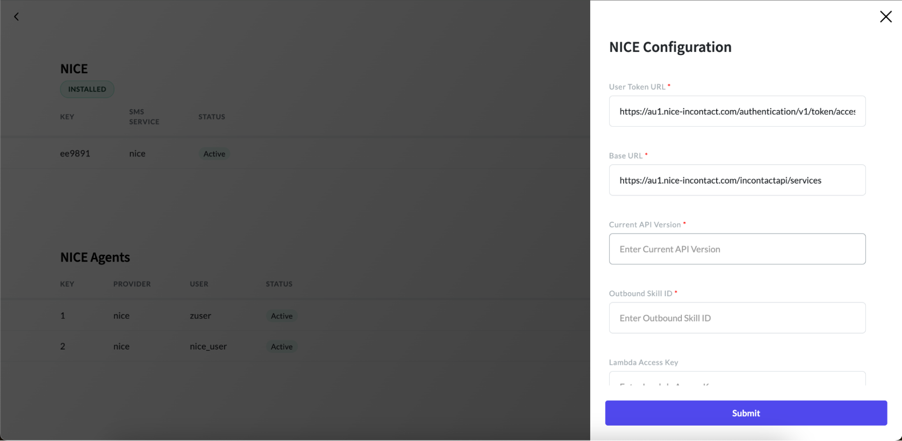

# Configuring NICE Package

After successfully installing the NICE package, you can proceed to configure it to suit your specific needs. Please ensure that you have installed the communication package. The NICE package relies on the communication package for seamless integration and functionality.

To add NICE configurations, follow the below steps:

#### 1. Access the App Panel

Navigate to your Zango application's landing page and access the App Panel.

#### 2. Navigate to the Communication package

In the App Panel, locate and click on the "Packages" menu and locate the “NICE” package.

#### 3. Access NICE Detail page

Click on the “View Details” link to access the details page of the communication package.

#### 4. Add New Configuration

In the details page, click on the "New Config" button.

#### 5. Fill in the Configuration Form

A form will appear for setting up a new configuration. Fill in the required fields, including:

- **User Token URL**: The URL used to obtain the user access token. It is typically provided by the Nice platform and is used to authenticate the user and generate an access token required for accessing Nice API endpoints.

- **Base URL**: The base URL of the NICE API serves as the root address for all API requests and responses. It specifies the location of the API endpoints and is essential for establishing communication with the NICE platform.

- **Current API Version**: The version of the NICE API to be used.

- **Outbound Skill ID**: It refers to a specific identifier assigned to an outbound Automatic Call Distribution (ACD). It is used to route outbound calls to the appropriate skill or group of agents based on predefined criteria such as skill proficiency or availability. It helps optimize call routing and ensures efficient handling of outbound calls within the NICE platform.

- **Lambda Access Key**: This key will be provided by Zango. It is a unique identifier required for accessing specific Lambda functions within the NICE platform.

