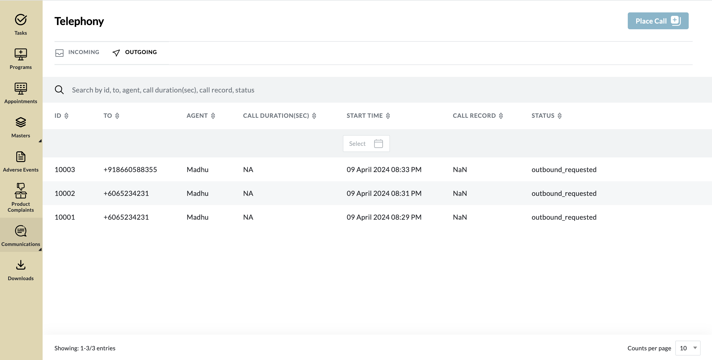
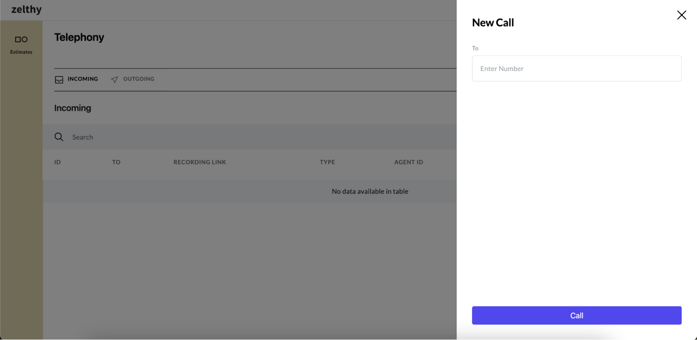

# Introducing Telephony

Telephony remains a cornerstone of communication, offering individuals the ability to engage in real-time conversations regardless of distance. With its accessibility and reliability, telephony serves as a fundamental component of modern communication strategies.

**Endpoint:** Access the telephony package through the following endpoint.

```python
 http(s)://<your_domain>/communication/dashboard/telephony
``` 
**Telephony Dashboard**: Effortlessly manage all telephony activities through the centralized telephony dashboard. View call history, manage ongoing calls, and call notes all in one convenient location.



**New Call Form**: With this intuitive interface, making calls becomes seamless and efficient, empowering you to connect with ease.



With the telephony package, facilitating effective communication through real-time telephonic conversations becomes streamlined and user-friendly, enhancing collaboration and connectivity across individuals and teams.
