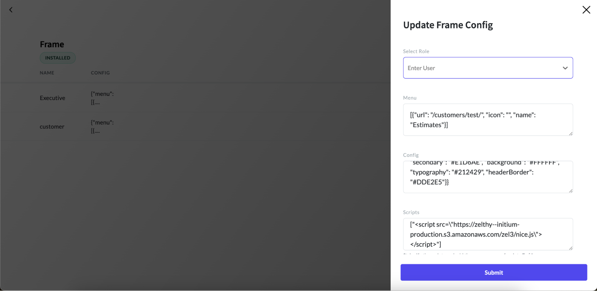

# Embedding Nice Script in the Frame

Embedding the Nice script into your frame configuration integrates key functionalities needed for call initiation and monitoring, enabling smooth communication with the Nice platform. By including it, your application gains access to essential features like call handling and event management, ensuring an enhanced user experience.
To include NICE script in the frame, follow these steps:
1. Access the frame configuration page in the App Panel.
2. Add the following config in the scripts section of the frame config:

```python
['<script src="https://zelthy--initium-production.s3.amazonaws.com/zel3/nice.js"></script>']
```


**Note:** Assign the frame to the same user role as the App user mapped with the Nice Agent.

### Session Management
During a session, the Nice JavaScript on the frame is executed, polling for events such as incoming and outbound calls on the website. Once the session concludes, a new session ID is created.

