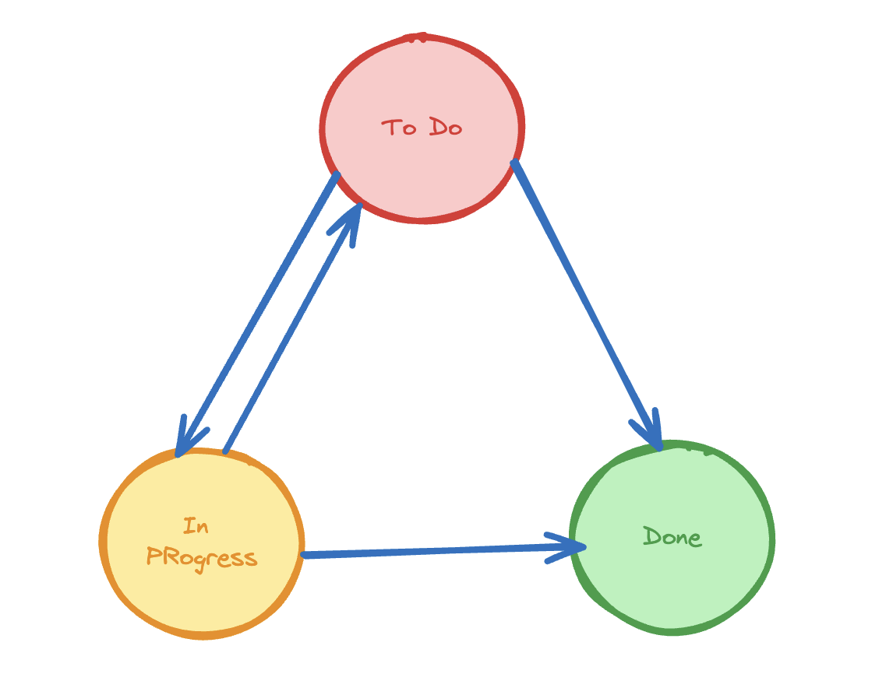

# Introducing Transitions

In the world of managing workflows, transitions are like traffic signals guiding the flow of work through different stages. They decide how tasks move from one step to the next within a system. Transitions are essential because they determine the order in which things get done and ensure that everything progresses smoothly. Let's take a closer look at what transitions are and why they're important in making sure workflows run smoothly:
#### **1.Transition Definition**

Transitions represent the movement of an entity, such as a task or an object, from one state to another within a workflow. These states, often referred to as statuses, define the different stages of progression.

#### **2.Mapping Statuses**

Users can map out the possible transitions between statuses, specifying attributes like names, descriptions, and confirmation messages. Represented as a directional graph, with statuses acting as nodes and transitions as edges, this visualization provides a clear understanding of the potential paths the workflow can take.

#### **3.Control and Predictability**

Transitions offer control and predictability over the workflow by ensuring that movements between statuses are explicitly defined. This prevents unintended actions and maintains consistency within the system.

#### **4. Types of Transitions**

- **Form-based Transitions**: Require user input through forms to facilitate a status change. This method captures detailed information about the transition, aiding in documentation and record-keeping.
- **Non-Form-based Transitions**: Directly transition to a specified status without additional form input, streamlining the process for simpler actions.

#### **5.Execution and Integration**

Transitions can be initiated and executed by users interacting with the system or automated processes running in the backend. This flexibility allows for seamless integration with various user interactions and backend tasks, enhancing workflow efficiency.

#### **6. Transaction Logging**

Each transition generates an associated document for recording the details of the transition. This transaction logging ensures transparency and accountability by providing an audit trail of status changes and associated metadata.

By understanding transitions as the bridges between different states within a workflow, you can effectively manage the progression of tasks and objects, ensuring smooth operations and optimal utilization of resources.
